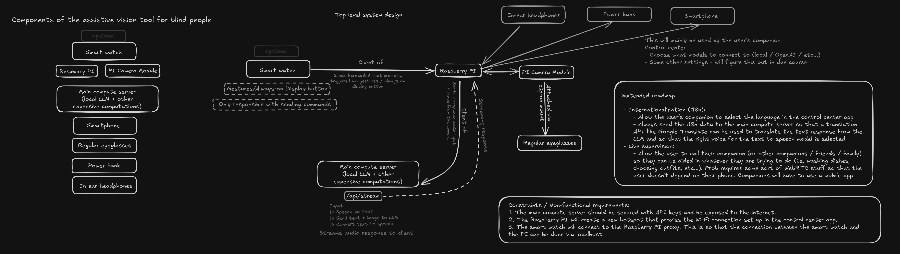
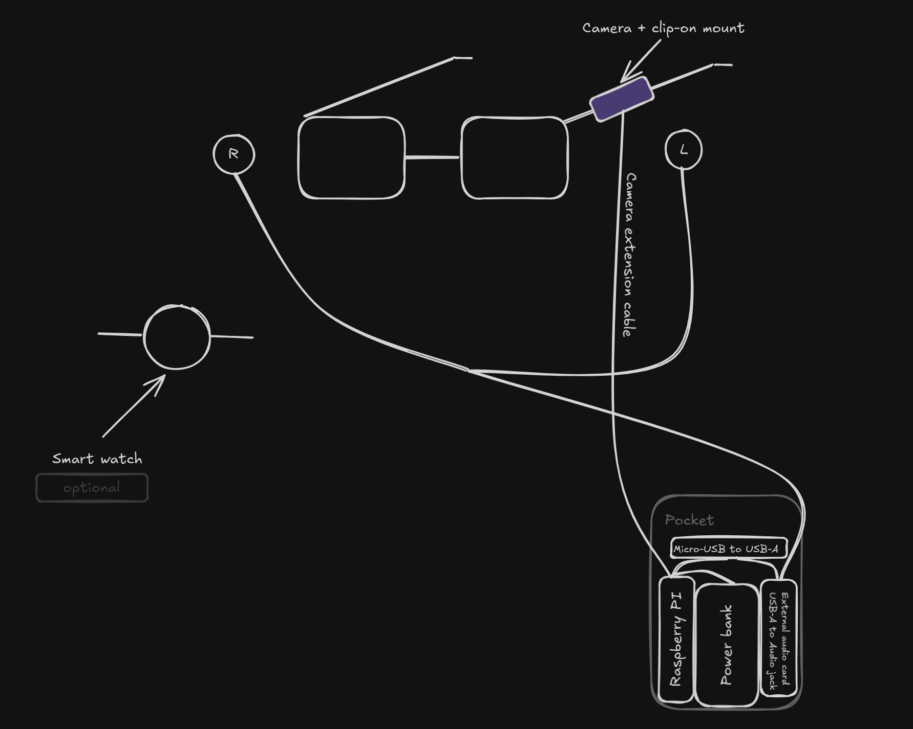

# Clip-on vision assist

> [!WARNING]
> This project is solely designed for and tailored to my personal needs. I'm merely open sourcing it in case someone has a family member with vision impairments
> and wants to help them out in some way.

## Hardware

### Shopping list

- Raspberry PI Zero W v2
- Raspberry PI Zero W v2 Camera module
- Camera module extension cable
- Cooler (?)
- Case (this one's cool: https://flirc.tv/products/flirc-raspberrypizero?variant=43085036519656)
- Micro SD card so i can flash an OS on the PI
